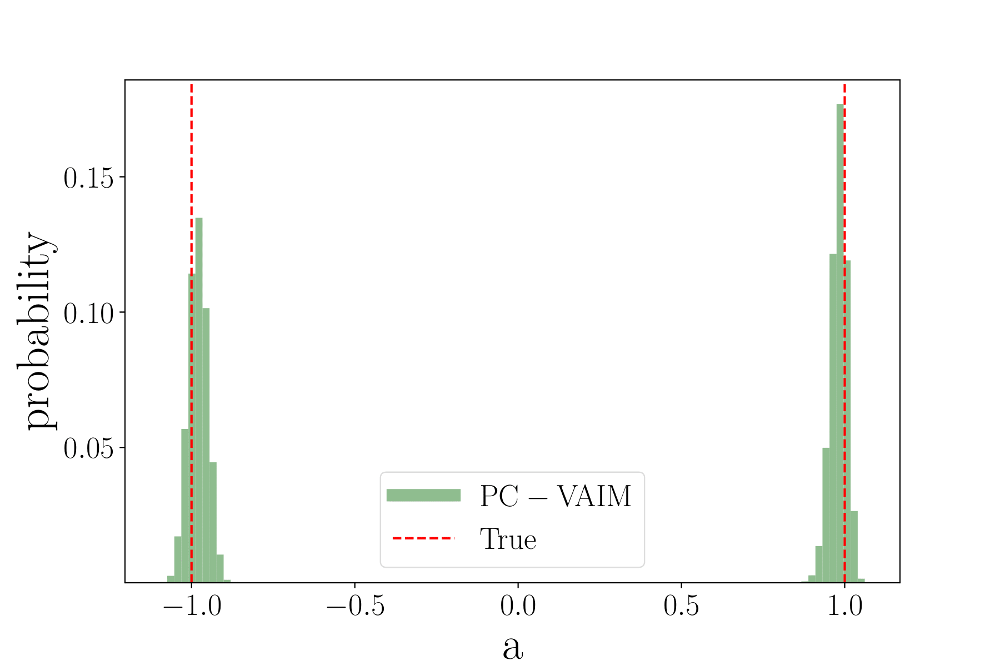
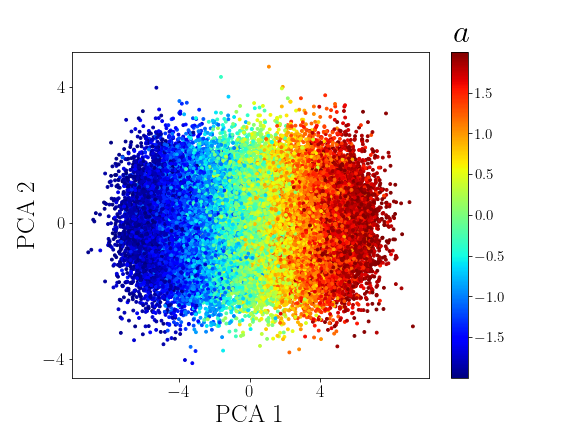

# PC-VAIM

**This is the implementation of Point Cloud-based Variational Autoencoder Inverse Mappers (PC-VAIM) - An Application on Quantum Chromodynamics Global Analysis.**


## Requirements
The code is written in Python=3.6, with the following libraries:
* tensorflow==2.8.0
* tensorflow_graphics==2021.12.3
* numpy==1.21.5
-------------------------------------------------------------------

* To get the list of all libraries with the dependencies, see the file:
``` bash
requirements.txt
``` 

## Getting started
* Install the python libraries.
* Download the code from GitHub:
```bash
git clone https://github.com/ecml-pkdd/PC-VAIM.git
cd PC-VAIM
```

* Run the python script:
``` bash
python3 train.py
``` 

* This will produce the toy example shown in the paper f</sub>(x) = 1.
* To see a demo, go to PC-VAIM_demo.ipynb that was trained for 100 epochs.
  
  
 ## Results:

 ## Example on toy data after 500 epochs:
| f</sub>(x) = (ax)<sup>2      | latent      |
|------------|-------------|
|  |  |

